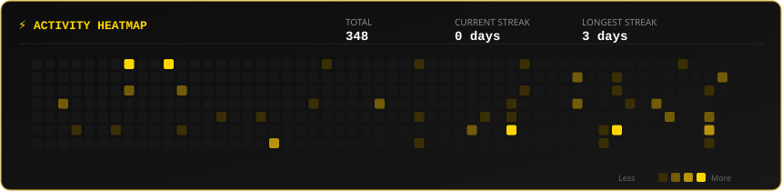

 

  

<h3 align="center"><code>System Identification</code></h3>
 

 

       

 

<h3 align="center"><code>Featured Creations</code></h3>

<table width="100%" cellspacing="0" cellpadding="12">

<tr>

<td width="50%" valign="top">

<h4 align="center">01. TexA — AI Textile Assistant</h4>

AI-powered textile assistant engineered for smart fabric calculations,
automated material analysis, image-based textile understanding,
and intelligent decision-making workflows.

<b>Tech Stack:</b> 
React • TypeScript • Python • Supabase • Tailwind CSS

</td>

<td width="50%" valign="top">

<h4 align="center">02. Learning Shelve</h4>

Cloudflare Edge-powered digital repository designed for fast discovery,
organization, and streamable access to educational resources.

<b>Tech Stack:</b> 
Cloudflare Workers • JavaScript • Node.js • REST API

</td>

</tr>

<tr>

<td width="50%" valign="top">

<h4 align="center">03. Birthday Wish Experience</h4>

An interactive digital birthday experience built with immersive
3D visuals, micro-interactions, animation, and custom audio integration.

<b>Tech Stack:</b> 
React • Three.js • Framer Motion • CSS3

</td>

<td width="50%" valign="top">

<h4 align="center">04. WhatsApp Spoofing Research</h4>

Cybersecurity research repository exploring SMS spoofing concepts,
message validation weaknesses, and network security protocols
for educational and security-research purposes.

<b>Tech Stack:</b> 
Python • Networking • Security Research

</td>

</tr>

</table>

 

<h3 align="center"><code>Technical Arsenal</code></h3>

<b>Frontend & 3D Web</b>

  

  

<b>Backend, Cloud & Databases</b>

  

  

<b>Mobile & Native Tools</b>

  

  

<b>DevOps & Workflows</b>

  

 

<h3 align="center"><code>Current Operations</code></h3>

| Focus | Topic / Project | Status |
| :---: | :--- | :---: |
| 🚀 **Currently Building** | Production LLM Evaluation & Agent Frameworks | `IN PROGRESS` |
| 📖 **Currently Learning** | Deep Learning with PyTorch & Distributed Systems | `ACTIVE` |
| ⚡ **Fun Fact** | Configures Linux environments manually & builds image-processing tools in Python | `TRUE` |

 

<h3 align="center"><code>GitHub Milestones</code></h3>

 

<h3 align="center"><code>GitHub Statistics</code></h3>

<svg xmlns="http://www.w3.org/2000/svg" width="600" height="220" viewBox="0 0 600 220">
  <defs>
    <linearGradient id="bg" x1="0%" y1="0%" x2="100%" y2="100%">
      <stop offset="0%" style="stop-color:#0d1117;stop-opacity:1" />
      <stop offset="100%" style="stop-color:#161b22;stop-opacity:1" />
    </linearGradient>
    <linearGradient id="streak" x1="0%" y1="0%" x2="100%" y2="0%">
      <stop offset="0%" style="stop-color:#f0883e;stop-opacity:1" />
      <stop offset="100%" style="stop-color:#f6a85b;stop-opacity:1" />
    </linearGradient>
    <linearGradient id="glow" x1="0%" y1="0%" x2="100%" y2="100%">
      <stop offset="0%" style="stop-color:#f0883e;stop-opacity:0.15" />
      <stop offset="100%" style="stop-color:#f6a85b;stop-opacity:0.05" />
    </linearGradient>
    <filter id="shadow">
      <feDropShadow dx="0" dy="2" stdDeviation="3" flood-color="#000" flood-opacity="0.3"/>
    </filter>
    <filter id="glowFilter">
      <feGaussianBlur stdDeviation="3" result="coloredBlur"/>
      <feMerge>
        <feMergeNode in="coloredBlur"/>
        <feMergeNode in="SourceGraphic"/>
      </feMerge>
    </filter>
  </defs>

  <!-- Animated background glow -->
  <rect width="600" height="220" rx="12" fill="url(#bg)" stroke="#30363d" stroke-width="1">
    <animate attributeName="stroke-opacity" values="0.6;1;0.6" dur="4s" repeatCount="indefinite"/>
  </rect>
  
  <!-- Hover glow ring -->
  <rect x="2" y="2" width="596" height="216" rx="12" fill="none" stroke="url(#glow)" stroke-width="2" opacity="0">
    <animate attributeName="opacity" values="0;0.6;0" dur="6s" repeatCount="indefinite"/>
  </rect>

  <!-- Header -->
  <text x="300" y="38" font-family="Segoe UI, Helvetica, Arial, sans-serif" font-size="16" font-weight="600" fill="#c9d1d9" text-anchor="middle" letter-spacing="0.5">
    GitHub Streak
    <animate attributeName="fill-opacity" values="0.7;1;0.7" dur="3s" repeatCount="indefinite"/>
  </text>

  <!-- Divider line -->
  <line x1="30" y1="52" x2="570" y2="52" stroke="#30363d" stroke-width="1">
    <animate attributeName="stroke-opacity" values="0.3;1;0.3" dur="5s" repeatCount="indefinite"/>
  </line>

  <!-- TOTAL CONTRIBUTIONS -->
  <text x="105" y="78" font-family="Segoe UI, Helvetica, Arial, sans-serif" font-size="11" fill="#8b949e" text-anchor="middle" font-weight="500">TOTAL CONTRIBUTIONS</text>
  <text x="105" y="108" font-family="Segoe UI, Helvetica, Arial, sans-serif" font-size="32" fill="#c9d1d9" text-anchor="middle" font-weight="bold">
    1,327
    <animate attributeName="fill" values="#c9d1d9;#58a6ff;#c9d1d9" dur="8s" repeatCount="indefinite"/>
  </text>

  <!-- Vertical Divider -->
  <line x1="200" y1="62" x2="200" y2="120" stroke="#30363d" stroke-width="1">
    <animate attributeName="stroke-opacity" values="0.3;1;0.3" dur="5s" repeatCount="indefinite" begin="0.5s"/>
  </line>

  <!-- LONGEST STREAK with pulse animation -->
  <text x="295" y="78" font-family="Segoe UI, Helvetica, Arial, sans-serif" font-size="11" fill="#8b949e" text-anchor="middle" font-weight="500">LONGEST STREAK</text>
  
  <!-- Glow behind longest streak number -->
  <text x="295" y="108" font-family="Segoe UI, Helvetica, Arial, sans-serif" font-size="32" fill="none" stroke="#f0883e" stroke-width="0.5" text-anchor="middle" font-weight="bold" opacity="0.3">
    28
    <animate attributeName="opacity" values="0.1;0.5;0.1" dur="2s" repeatCount="indefinite"/>
    <animate attributeName="stroke-width" values="0.5;3;0.5" dur="2s" repeatCount="indefinite"/>
  </text>
  
  <text x="295" y="108" font-family="Segoe UI, Helvetica, Arial, sans-serif" font-size="32" fill="#f0883e" text-anchor="middle" font-weight="bold" filter="url(#glowFilter)">
    28
    <animate attributeName="fill" values="#f0883e;#f6a85b;#f0883e" dur="3s" repeatCount="indefinite"/>
  </text>
  
  <text x="295" y="128" font-family="Segoe UI, Helvetica, Arial, sans-serif" font-size="11" fill="#8b949e" text-anchor="middle">DAYS</text>

  <!-- Vertical Divider -->
  <line x1="400" y1="62" x2="400" y2="120" stroke="#30363d" stroke-width="1">
    <animate attributeName="stroke-opacity" values="0.3;1;0.3" dur="5s" repeatCount="indefinite" begin="1s"/>
  </line>

  <!-- CURRENT STREAK -->
  <text x="500" y="78" font-family="Segoe UI, Helvetica, Arial, sans-serif" font-size="11" fill="#8b949e" text-anchor="middle" font-weight="500">CURRENT STREAK</text>
  <text x="500" y="108" font-family="Segoe UI, Helvetica, Arial, sans-serif" font-size="32" fill="#c9d1d9" text-anchor="middle" font-weight="bold">
    13
    <animate attributeName="fill" values="#c9d1d9;#58a6ff;#c9d1d9" dur="8s" repeatCount="indefinite" begin="2s"/>
  </text>
  <text x="500" y="128" font-family="Segoe UI, Helvetica, Arial, sans-serif" font-size="11" fill="#8b949e" text-anchor="middle">DAYS</text>

  <!-- Bottom section divider -->
  <line x1="30" y1="148" x2="570" y2="148" stroke="#30363d" stroke-width="1">
    <animate attributeName="stroke-opacity" values="0.3;1;0.3" dur="5s" repeatCount="indefinite" begin="1.5s"/>
  </line>

  <!-- ACTIVE DAYS with count animation -->
  <text x="150" y="175" font-family="Segoe UI, Helvetica, Arial, sans-serif" font-size="11" fill="#8b949e" text-anchor="middle" font-weight="500">ACTIVE DAYS</text>
  <text x="150" y="200" font-family="Segoe UI, Helvetica, Arial, sans-serif" font-size="20" fill="#c9d1d9" text-anchor="middle" font-weight="bold">
    345
    <animate attributeName="fill" values="#c9d1d9;#f6a85b;#c9d1d9" dur="6s" repeatCount="indefinite"/>
  </text>

  <!-- Tags with staggered fade -->
  <text x="400" y="175" font-family="Segoe UI, Helvetica, Arial, sans-serif" font-size="12" fill="#58a6ff" text-anchor="middle" font-weight="500">
    Active learner
    <animate attributeName="opacity" values="0.5;1;0.5" dur="4s" repeatCount="indefinite" begin="0s"/>
  </text>
  <text x="400" y="195" font-family="Segoe UI, Helvetica, Arial, sans-serif" font-size="12" fill="#58a6ff" text-anchor="middle" font-weight="500">
    Developer
    <animate attributeName="opacity" values="0.5;1;0.5" dur="4s" repeatCount="indefinite" begin="1.3s"/>
  </text>
  <text x="400" y="215" font-family="Segoe UI, Helvetica, Arial, sans-serif" font-size="12" fill="#58a6ff" text-anchor="middle" font-weight="500">
    Researcher
    <animate attributeName="opacity" values="0.5;1;0.5" dur="4s" repeatCount="indefinite" begin="2.6s"/>
  </text>

  <!-- Animated fire icon with floating effect -->
  <text x="265" y="105" font-family="Segoe UI, Helvetica, Arial, sans-serif" font-size="18" fill="#f0883e">
    🔥
    <animate attributeName="y" values="105;100;105" dur="2s" repeatCount="indefinite"/>
    <animate attributeName="font-size" values="18;20;18" dur="2s" repeatCount="indefinite"/>
  </text>

  <!-- Decorative animated dots -->
  <circle cx="30" cy="30" r="2" fill="#f0883e" opacity="0.3">
    <animate attributeName="opacity" values="0.1;0.6;0.1" dur="3s" repeatCount="indefinite"/>
    <animate attributeName="r" values="2;3;2" dur="3s" repeatCount="indefinite"/>
  </circle>
  <circle cx="570" cy="30" r="2" fill="#58a6ff" opacity="0.3">
    <animate attributeName="opacity" values="0.1;0.6;0.1" dur="3s" repeatCount="indefinite" begin="1s"/>
    <animate attributeName="r" values="2;3;2" dur="3s" repeatCount="indefinite" begin="1s"/>
  </circle>
</svg>

 

<h3 align="center"><code>Socials & Connect</code></h3>

  

<b>Scan to view Portfolio on Mobile</b>

  

 

